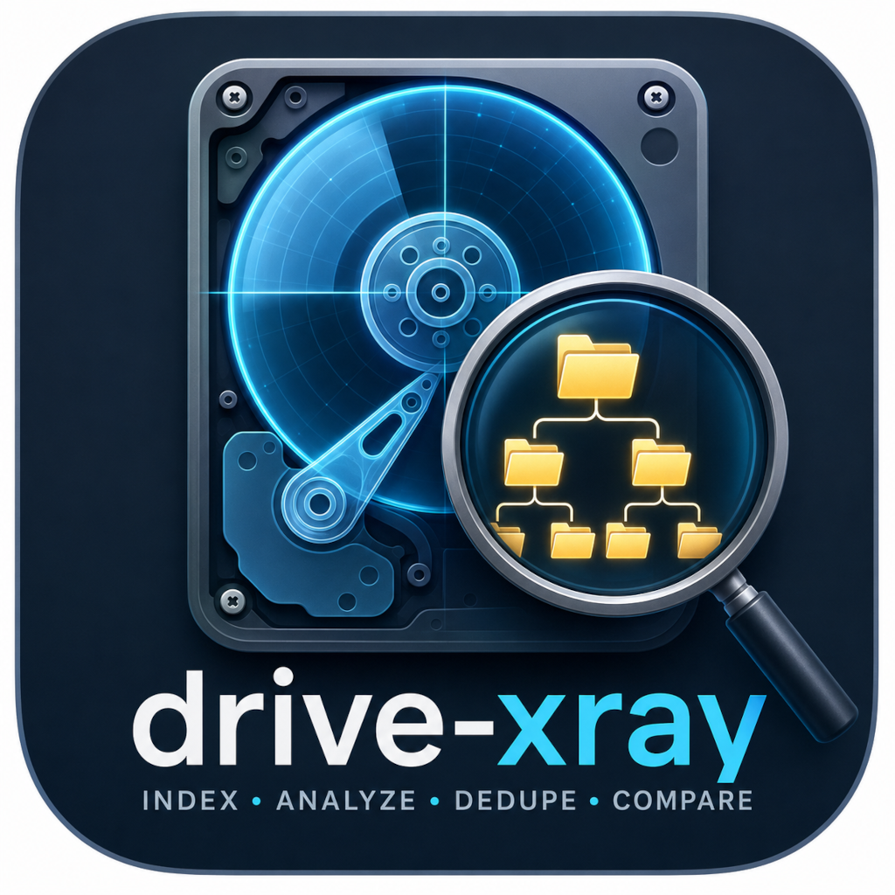
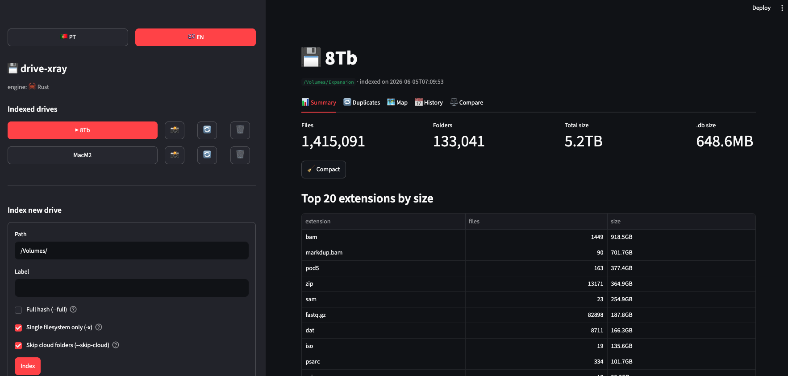

<div align="center">



# drive-xray

**Know exactly what's on every drive, and what's redundant across them.**

[](https://www.apple.com/macos/)
[](https://www.microsoft.com/windows/)
[](https://www.python.org/)
[](https://www.rust-lang.org/)
[](LICENSE)

</div>

---

## Who this is for

This was built for people who **live with many USB drives scattered
across their desk**, deal with **huge bioinformatics files** (BAMs,
FASTQs, aligned VCFs), feel **some passion for photography** (RAWs,
Lightroom projects, edits), and want to be **certain about what's
stored on each drive** and **what's redundant** between them.

The kind of questions this answers:

- *"Have I already backed up this video, or is it only on the
  internal SSD?"*
- *"Which new files showed up on the NAS since last week?"*
- *"Is the backup of this old drive still the same content, or has it
  drifted?"*
- *"If I wipe external drive #3, will I lose anything that isn't
  somewhere else?"*
- *"What are the 10 folders that grew the most in this project this
  month?"*

The core idea is simple: **each drive gets an "x-ray" — a portable
SQLite `.db`** that remembers what files lived there, their size,
when they were modified, and a hash of each. Then you just compare.
The drive can be unplugged — the x-ray keeps answering.

---

## Screenshot

<div align="center">

<br/>
<sub>A real-world session: 1,415,091 files / 5.2 TB on an external 8 TB drive of sequencing data (BAMs, FASTQ.gz, pod5), <code>.db</code> compressed to just 648 MB with Tier-3 path interning. Engine: 🦀 Rust.</sub>
</div>

---

## What it does

- 🔍 **Index drives** (internal + external) into a portable SQLite
  `.db`. Hybrid hashing (BLAKE2b partial + full only where needed).
- 🔁 **Find duplicates** within a drive, with hardlink awareness
  (virtual copies don't inflate the "wasted space" count).
- 📅 **Historical snapshots** — take monthly/weekly "photos" and diff
  them: "+ 487 GB in `sequencing/run-2025-06/`, − 12 GB in `tmp/`".
- ⚖️ **Compare two drives** even offline. *"Is this copy still equal
  to the original? Which files exist only on one side?"*
- 🗺️ **Interactive TreeMap** of space by folder (WizTree / GrandPerspective style).
- 🧽 **Assisted cleanup** — generates a `.sh` script you **review**
  before running. Quarantine or delete; never deletes on its own.
- 📊 **Export** duplicates to CSV or XLSX for Excel review.
- 🦀 **Optional Rust engine** for large drives — ~10× faster on
  5 M files, **byte-for-byte** compatible `.db` files.

macOS-specific defenses:

- `--one-filesystem` avoids traversing APFS firmlinks (so your files
  aren't double-counted via `/System/Volumes/Data`).
- `--skip-cloud` ignores iCloud / OneDrive / Google Drive / Dropbox /
  Box / MEGA / Proton folders — doesn't trigger downloads of
  online-only files.

---

## Quick install

### macOS / Linux

```bash
git clone https://github.com/rbleite/drive-xray.git
cd drive-xray
python3 -m venv .venv
.venv/bin/pip install -r requirements.txt
.venv/bin/streamlit run app.py
```

Or build a **clickable `.app` launcher** (recommended for daily use):

```bash
bash build_app.sh
open ~/Applications/drive-xray.app
```

(The launcher auto-opens your browser at http://localhost:8501, with a
real icon in the Dock and Spotlight.)

### Windows

Requirements: [Python 3.10+](https://www.python.org/downloads/) — during install, tick **"Add Python to PATH"**.

```bat
git clone https://github.com/rbleite/drive-xray.git
cd drive-xray
start.bat
```

`start.bat` creates a virtual environment, installs dependencies, and launches the UI — all in one step. Double-click it on subsequent runs.

> **Tip:** to index a drive from the CLI on Windows, use the `dx` command in the same terminal:
> ```bat
> .venv\Scripts\python drive_xray.py index D:\ --label "External_D"
> ```

> **Faster engine (optional):** the pure-Python engine indexes everything on
> Windows out of the box. For very large drives, download
> `dx-<version>-windows-x86_64.zip` from the
> [Releases](https://github.com/rbleite/drive-xray/releases) page, unzip
> `dx.exe` into the project folder, and the UI switches to `engine: 🦀 Rust`
> automatically — the `.db` files are byte-identical either way.

#### Desktop shortcuts / start at login (Windows)

`setup_shortcuts.ps1` creates launch "buttons" so you never open a terminal:

```powershell
.\setup_shortcuts.ps1            # Desktop + Start Menu shortcuts
.\setup_shortcuts.ps1 -Startup   # also start automatically at login
.\setup_shortcuts.ps1 -Remove    # undo everything it created
```

If [media-catalog](https://github.com/rbleite/media-catalog) is cloned next
to this project (same parent folder), it gets its own shortcuts too — its
`run.bat` serves on port 8503, so both apps can run at the same time. Use
`-MediaCatalog "C:\path\to\media-catalog"` when it lives elsewhere.

(On macOS the equivalent is `./build_app.sh`, which builds a double-click
`~/Applications/drive-xray.app` — add it to **System Settings → Login Items**
to start it at login. media-catalog ships its own `build_app.sh` as well.)

### Multi-machine sync (OneDrive / Google Drive / Dropbox)

Store all `.db` index files in a shared cloud folder so every machine
sees every drive — even offline.

1. Open the UI → sidebar → **⚙️ Configurações / Settings**
2. Set the folder to your local OneDrive/GDrive path (e.g. `C:\Users\you\OneDrive`)
3. Click **Import .db files from this folder** to pick up indexes synced from other machines
4. New indexes created on this machine go there automatically

Mount points are resolved automatically across machines and operating
systems: a drive indexed on macOS at `/Volumes/MyDisk` is recognized when
plugged into Windows (`E:\`) or Linux (`/media/<user>/MyDisk`) — the app
matches the drive's actual content (its top-level entries) against the
mounted volumes, so verify, refresh, dedupe and delete keep working
wherever the disk shows up.

### Optional Rust engine (~10× faster on large drives)

```bash
curl --proto '=https' --tlsv1.2 -sSf https://sh.rustup.rs | sh -s -- -y
cd rust
rustup target add aarch64-apple-darwin x86_64-apple-darwin
cargo build --release --target aarch64-apple-darwin
cargo build --release --target x86_64-apple-darwin
lipo -create -output target/universal/dx \
    target/aarch64-apple-darwin/release/dx \
    target/x86_64-apple-darwin/release/dx
```

The Streamlit UI auto-detects the Rust binary — the sidebar shows
`engine: 🦀 Rust` instead of `🐍 Python`. The `.db` files are
byte-identical, so you can switch engines at will.

### Or via Homebrew (if available)

```bash
brew tap rbleite/tap
brew install drive-xray
```

This installs the universal `dx` binary plus a `drive-xray-ui`
launcher shortcut.

---

## How it works (in brief)

1. **Hybrid indexing** — partial hash (head + middle + tail × 64 KB,
   BLAKE2b 128) is constant-time per file. Full hash (BLAKE2b 256) is
   computed **only** on duplicate candidates. On 30 TB this saves
   hours vs. "hash everything".
2. **Snapshots** — each `dx snapshot take` creates an immutable
   record. `dx diff #2 #5` shows growth and shrink per folder between
   two points in time.
3. **Schema v5 with path interning** — every directory name lives once
   in the `paths` table. On a 1.4 M-file drive this cuts the `.db`
   from ~1 GB down to ~650 MB.
4. **macOS-aware** — `-x` (firmlinks), `--skip-cloud`, 64-bit inode
   handling on exFAT/NTFS without overflow.

Full documentation: [`DOCS.md`](DOCS.md).
Rust engine architecture: [`rust/DESIGN.md`](rust/DESIGN.md).

---

## Benchmark

Tested on Apple Silicon (M2 Pro), Apple SSD:

| Workload | Python | Rust + mimalloc | Speedup |
|---|---:|---:|---:|
| 5,284 files / 750 MB | 1.45 s | 0.13 s | **11.5 ×** |
| 2,000 files / 10 MB (50 dup groups) | 180 ms | 30 ms | **6 ×** |

Real-world: 1.4 M files / 5.2 TB external drive → `.db` 648 MB,
indexing in ~14 min on Rust.

---

## Roadmap

| Status | Component |
|---|---|
| ✅ | Hybrid v2 hashing (head + middle + tail) |
| ✅ | Folder Merkle hash |
| ✅ | macOS firmlinks / cloud sync filters |
| ✅ | Schema v5 with path interning (Tier 3) |
| ✅ | Incremental refresh (reuses unchanged hashes) |
| ✅ | Historical snapshots + diff + prune |
| ✅ | TreeMap (Plotly) |
| ✅ | Assisted cleanup (`.sh` script + quarantine) |
| ✅ | Bilingual UI (PT/EN) |
| ✅ | Rust engine (~10× faster) |
| ✅ | macOS `.app` launcher |
| ✅ | Homebrew tap |
| 🔜 | Snapshots V2 — content-addressed (smaller history) |
| 🔜 | APFS clone detection (`clonefile`) |
| 🔜 | In-UI cleanup execution with quarantine |
| 🔜 | Search query language (`*.bam >100 GB modified<2024`) |

---

## License

[Apache 2.0](LICENSE) — use, modify and redistribute freely, but the
copyright notice and [`NOTICE`](NOTICE) file **must be preserved** in
any derivative work. See clause 4 of the license for the exact terms.

If you publish a fork or product that includes this code, please keep
the attribution visible. That's the only thing asked in return.

---

## Português

Esta aplicação foi pensada para quem **vive com muitas drives USB
espalhadas pela secretária**, lida com **ficheiros gigantes de
bioinformática** (BAMs, FASTQs, VCFs alinhados), nutre **alguma
paixão pela fotografia** (RAWs, projetos Lightroom, edições) — e
quer ter a **certeza do que está armazenado em cada drive** e **qual
a redundância** entre elas.

**Tipos de pergunta que isto responde:**

- *"Já tenho este vídeo backuped, ou só está no SSD interno?"*
- *"Que ficheiros novos apareceram no NAS desde a última semana?"*
- *"O backup desta drive antiga ainda é o mesmo conteúdo, ou
  divergiu?"*
- *"Se eu apagar tudo na drive externa #3, perco alguma coisa que
  não esteja noutro lado?"*
- *"Quais são as 10 pastas que mais cresceram no projecto este
  mês?"*

**A ideia central é simples:** cada drive ganha um **"raio-x" — uma
`.db` SQLite portátil** que sabe que ficheiros lá viviam, qual o
tamanho, quando foram modificados, e o hash de cada um. Depois é só
comparar. A drive pode estar desligada — o raio-x continua a
responder.

A UI Streamlit é bilingue: clica no botão **🇵🇹 PT** no topo da
sidebar para mudar todos os textos para português. Os comandos CLI
e mensagens técnicas mantêm-se em inglês.

**Documentação técnica completa em [`DOCS.md`](DOCS.md).**

---

<div align="center">
<sub>Built by someone who has 12 USB drives in a drawer and wanted to know what's actually on them.</sub>
</div>
