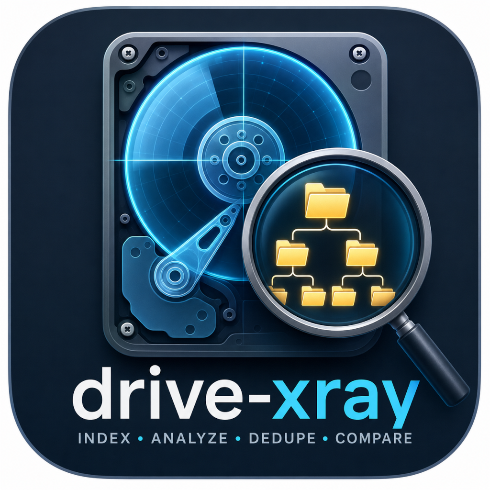
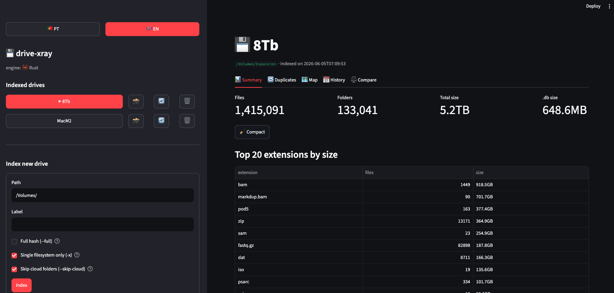

<div align="center">



# drive-xray

**Know exactly what's on every drive, and what's redundant across them.**

[](https://www.apple.com/macos/)
[](https://www.microsoft.com/windows/)
[](https://www.python.org/)
[](https://www.rust-lang.org/)
[](LICENSE)

</div>

---

## Who this is for

This was built for people who **live with many USB drives scattered
across their desk**, deal with **huge bioinformatics files** (BAMs,
FASTQs, aligned VCFs), feel **some passion for photography** (RAWs,
Lightroom projects, edits), and want to be **certain about what's
stored on each drive** and **what's redundant** between them.

The kind of questions this answers:

- *"Have I already backed up this video, or is it only on the
  internal SSD?"*
- *"Which new files showed up on the NAS since last week?"*
- *"Is the backup of this old drive still the same content, or has it
  drifted?"*
- *"If I wipe external drive #3, will I lose anything that isn't
  somewhere else?"*
- *"What are the 10 folders that grew the most in this project this
  month?"*

The core idea is simple: **each drive gets an "x-ray" — a portable
SQLite `.db`** that remembers what files lived there, their size,
when they were modified, and a hash of each. Then you just compare.
The drive can be unplugged — the x-ray keeps answering.

---

## Screenshot

<div align="center">

<br/>
<sub>A real-world session: 1,415,091 files / 5.2 TB on an external 8 TB drive of sequencing data (BAMs, FASTQ.gz, pod5), <code>.db</code> compressed to just 648 MB with Tier-3 path interning. Engine: 🦀 Rust.</sub>
</div>

---

## What it does

- 🔍 **Index drives** (internal + external) into a portable SQLite
  `.db`. Hybrid hashing (BLAKE2b partial + full only where needed).
- 🔁 **Find duplicates** within a drive, with hardlink awareness
  (virtual copies don't inflate the "wasted space" count).
- 📅 **Historical snapshots** — take monthly/weekly "photos" and diff
  them: "+ 487 GB in `sequencing/run-2025-06/`, − 12 GB in `tmp/`".
- ⚖️ **Compare two drives** even offline. *"Is this copy still equal
  to the original? Which files exist only on one side?"*
- 🗺️ **Interactive TreeMap** of space by folder (WizTree / GrandPerspective style).
- 🧽 **Assisted cleanup** — generates a `.sh` script you **review**
  before running. Quarantine or delete; never deletes on its own.
- 📊 **Export** duplicates to CSV or XLSX for Excel review.
- 🦀 **Optional Rust engine** for large drives — ~10× faster on
  5 M files, **byte-for-byte** compatible `.db` files.

On macOS it also avoids two classic traps: APFS firmlinks (which would
double-count your files) and cloud folders (indexing them would trigger
downloads of online-only files).

---

## Install

### Windows

Open PowerShell (Start menu → type `powershell`) and paste this one line:

```powershell
irm https://raw.githubusercontent.com/rbleite/drive-xray/main/install.ps1 | iex
```

That is the whole install, on a machine with **nothing** on it. PowerShell
ships with Windows; the script installs Python, git, drive-xray and
[media-catalog](https://github.com/rbleite/media-catalog), and leaves you a
**button on your Desktop**. Run the same line again any time to update.

### macOS / Linux

```bash
git clone https://github.com/rbleite/drive-xray.git
cd drive-xray
bash build_app.sh
open ~/Applications/drive-xray.app
```

That builds a double-click launcher with a real icon in the Dock and
Spotlight. It opens your browser at http://localhost:8501.

> Prefer to do it by hand, use Homebrew, or build the Rust engine yourself?
> See **[docs/install.md](docs/install.md)**.

---

## First steps

Once the app is open:

1. **Index a drive.** Sidebar → pick a folder or a mounted volume, give it a
   label (`External_8TB`), and start. This is the "x-ray": from here on the
   drive can be unplugged and still answer questions.
2. **Look at the TreeMap** to see where the space actually went.
3. **Find duplicates** — the wasted-space number already accounts for
   hardlinks, so it is the real figure, not an inflated one.
4. **Index a second drive**, then **compare the two**. This is where the tool
   earns its keep: what exists only on one side, and what is safely redundant.
5. **Take a snapshot** now and another next month, then diff them to see what
   grew.
6. **Search across every drive** — `dx find "*.mkv" ">20GB"`, or the Find tab.
   This works with the drives unplugged, which is the point of having indexed
   them. See [docs/search.md](docs/search.md).

Nothing is ever deleted for you. Cleanup produces a script for you to read
first.

---

## Documentation

| Page | What's in it |
|---|---|
| [docs/install.md](docs/install.md) | Manual installs, Homebrew, desktop shortcuts, start-at-login, building the Rust engine |
| [docs/search.md](docs/search.md) | Finding things by name, size and date across every drive |
| [docs/how-it-works.md](docs/how-it-works.md) | Hybrid hashing, snapshots, the schema, and benchmarks |
| [docs/sync.md](docs/sync.md) | Using one catalogue across several machines (OneDrive / Drive / Dropbox) |
| [docs/reference.md](docs/reference.md) | Full CLI reference (PT) — every command, flag and example |
| [rust/DESIGN.md](rust/DESIGN.md) | Rust engine architecture |
| [docs/roadmap.md](docs/roadmap.md) | What's done and what's next |

**Companion app:** [media-catalog](https://github.com/rbleite/media-catalog)
turns a drive-xray index into a browsable gallery of your films, series,
albums and games. The Windows installer above sets up both.

---

## License

[Apache 2.0](LICENSE) — use, modify and redistribute freely, but the
copyright notice and [`NOTICE`](NOTICE) file **must be preserved** in
any derivative work. See clause 4 of the license for the exact terms.

If you publish a fork or product that includes this code, please keep
the attribution visible. That's the only thing asked in return.

---

## Português

Esta aplicação foi pensada para quem **vive com muitas drives USB
espalhadas pela secretária**, lida com **ficheiros gigantes de
bioinformática** (BAMs, FASTQs, VCFs alinhados), nutre **alguma
paixão pela fotografia** (RAWs, projetos Lightroom, edições) — e
quer ter a **certeza do que está armazenado em cada drive** e **qual
a redundância** entre elas.

**Tipos de pergunta que isto responde:**

- *"Já tenho este vídeo backuped, ou só está no SSD interno?"*
- *"Que ficheiros novos apareceram no NAS desde a última semana?"*
- *"O backup desta drive antiga ainda é o mesmo conteúdo, ou
  divergiu?"*
- *"Se eu apagar tudo na drive externa #3, perco alguma coisa que
  não esteja noutro lado?"*
- *"Quais são as 10 pastas que mais cresceram no projecto este
  mês?"*

**A ideia central é simples:** cada drive ganha um **"raio-x" — uma
`.db` SQLite portátil** que sabe que ficheiros lá viviam, qual o
tamanho, quando foram modificados, e o hash de cada um. Depois é só
comparar. A drive pode estar desligada — o raio-x continua a
responder.

A UI Streamlit é bilingue: clica no botão **🇵🇹 PT** no topo da
sidebar para mudar todos os textos para português. Os comandos CLI
e mensagens técnicas mantêm-se em inglês.

**Documentação técnica completa em [`docs/reference.md`](docs/reference.md).**

---

<div align="center">
<sub>Built by someone who has 12 USB drives in a drawer and wanted to know what's actually on them.</sub>
</div>
